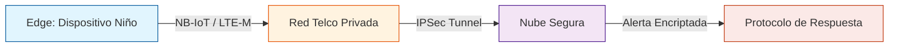

# DOCUMENTO 00: RESUMEN EJECUTIVO

# Proyecto: Voz de Cristal
<strong>Cuando el sistema calla, la tecnología habla.</strong>

**Proyecto Voz de Cristal**

Voz de Cristal es una iniciativa tecnológica y social orientada a la protección de la infancia vulnerada, nacida desde la experiencia personal y la convicción ética de sus impulsores. El proyecto propone un sistema de alerta y registro basado en hardware de bajo costo, inteligencia artificial y estrictos estándares de privacidad, capaz de actuar como testigo independiente en situaciones de riesgo para niños y niñas.

## Problema
En Chile y el mundo, la mayoría de los casos de abuso infantil ocurren en entornos de confianza, donde los sistemas tradicionales de protección suelen fallar. Según UNICEF, el 71% de los niños en Chile sufre algún tipo de violencia de sus cuidadores ([UNICEF Chile](https://www.unicef.org/chile/comunicados-prensa/unicef-conmemora-el-d%C3%ADa-mundial-de-la-infancia-con-un-llamado-actuar-hoy-para). Informes de la Defensoría de la Niñez evidencian brechas críticas en la rapidez de las medidas de protección y saturación del sistema judicial ([Defensoría de la Niñez](https://www.defensorianinez.cl/informe-anual-2025/)). La falta de respuesta oportuna y la dificultad para obtener pruebas confiables perpetúan la vulneración de derechos.

## Solución Propuesta
Voz de Cristal plantea un dispositivo portátil, discreto y seguro, que solo transmite datos en situaciones críticas detectadas por algoritmos locales (TinyML). El sistema prioriza la privacidad, la seguridad y la inmutabilidad de la evidencia, integrándose con redes privadas y protocolos de respuesta social y legal. La tecnología NB-IoT, recomendada por la GSMA y ya operativa en Chile ([GSMA NB-IoT](https://www.gsma.com/iot/resources/nb-iot-deployment-guide/)), permite cobertura profunda y bajo costo operativo.

## Impacto Esperado
- Reducción de la impunidad en casos de abuso infantil.
- Generación de evidencia confiable y protegida.
- Empoderamiento de redes de apoyo y autoridades.
- Protección efectiva y no invasiva para los niños.
- Arquitectura basada en hardware costo-eficiente y componentes estandarizados, permitiendo una implementación masiva con una inversión significativamente menor a los costos actuales de judicialización y reparación de daños crónicos en la infancia.

## Sostenibilidad y Viabilidad
El costo de reparar el daño es varias veces mayor que el de proteger a tiempo. Voz de Cristal busca cerrar esa brecha, permitiendo que la inversión social se enfoque en prevención y no solo en reparación.

## Invitación
El proyecto está abierto a la colaboración de instituciones, empresas, municipios, académicos y profesionales de todas las áreas. No se busca financiamiento directo ni créditos personales, sino sumar capacidades para llevar esta solución a quienes más la necesitan.

---

Para más detalles y respaldo de datos, ver el Anexo de Fuentes y Referencias Técnicas.

---

<strong>Impulsores del Proyecto:</strong> 
<ul>
<li><strong>Héctor Águila</strong> – Arquitectura de Solución</li>
<li><strong>Yaneth Villegas</strong> – Dirección de Vinculación Social</li>
</ul>

Ambos ponen a disposición de la sociedad esta base conceptual y técnica, invitando a instituciones, empresas y profesionales a sumarse para llevarla a la realidad.

# DOCUMENTO 01: MARCO CONCEPTUAL Y FUNDAMENTACIÓN

# Proyecto: Voz de Cristal
<strong>Cuando el sistema calla, la tecnología habla.</strong>

**ID:** VC-2026-CH-01-DOC01

## 1. El Nombre: Fundamento Filosófico

### Transparencia
Representa la verdad técnica inmutable frente a la manipulación de relatos en casos de abuso.

### Fragilidad Resiliente
La infancia es un cristal que parece romperse, pero bajo este sistema, ese "estallido" se convierte en una alarma sónica y digital imposible de ignorar.

## 2. Definición del Problema

El proyecto aborda la **"Falla de Respuesta en Entornos de Confianza"**.

> Cuando el agresor es el tutor legal, los sistemas actuales de protección quedan anulados. **Voz de Cristal** actúa como un testigo independiente y autónomo.

# DOCUMENTO 02: ESPECIFICACIÓN TÉCNICA DE ARQUITECTURA

**Responsable:** Héctor Aguila (Arquitectura de Solución)
**ID:** VC-2026-CH-01-DOC02

## 1. Hardware (The Edge)

### Microcontrolador
**Propuesta:** SoC con soporte NB-IoT/LTE-M (ej. Simcom o Quectel).
- **Justificación:** Estos módulos permiten transmisión en bandas de baja frecuencia con alta penetración en concreto ([GSMA NB-IoT](https://www.gsma.com/iot/resources/nb-iot-deployment-guide/)).

### Sensores
- **Acelerómetro:** De baja potencia para detección de impactos.
- **Sensor PPG:** Para monitoreo de frecuencia cardíaca (HRV).

### Protección
- **Certificación IP68.**
- **Encapsulado:** Resina epóxica para evitar manipulación o daño por líquidos.

## 2. Software e Inteligencia Artificial

### Algoritmo de Detección
Implementación de modelos de clasificación (**Random Forest**) en la nube para identificar patrones de pánico. El uso de IA en protección infantil está respaldado por literatura científica y experiencias internacionales (ver Anexo de Fuentes).
> *Patrón de Pánico = Taquicardia Súbita + Movimiento Defensivo.*

### Seguridad
- **Transporte:** Protocolo TLS 1.3.
- **Almacenamiento:** Encriptación AES-256 para audio almacenado.

---
## Fuentes y Referencias
- GSMA: [NB-IoT Deployment Guide](https://www.gsma.com/iot/resources/nb-iot-deployment-guide/)
- Ver Anexo de Fuentes y Referencias Técnicas

# DOCUMENTO 03: PROTOCOLO DE GESTIÓN E IMPACTO SOCIAL

**Responsable:** Yaneth Villegas (Directora de Vinculación Social)
**ID:** VC-2026-CH-01-DOC03

## 1. El Protocolo de Bypass Judicial

El sistema **no envía alertas al teléfono de los padres por defecto** si existe una denuncia previa o si se configura el "Modo Riesgo Intrafamiliar". Esta medida responde a la realidad de que la mayoría de los abusos ocurren en el entorno familiar ([UNICEF Chile](https://www.unicef.org/chile/publicaciones)).

**La alerta se dirige a:**
*   Central de Emergencias Policiales.
*   Red de Apoyo Validada (Educadores/Familiares externos).

## 2. Diseño Centrado en el Niño

El rol social garantiza que el hardware **no sea estigmatizante**. Esta estrategia está alineada con recomendaciones internacionales para evitar la revictimización y el estigma social en niños vulnerados ([Defensoría de la Niñez](https://www.defensorianinez.cl/informes-anuales/)).
- Debe ser joyería común (*bijouterie*) o elementos educativos.
- **Objetivo:** Evitar que el agresor sospeche de la presencia de tecnología de rastreo.

---
## Fuentes y Referencias
- UNICEF Chile: [Análisis de la violencia hacia niños, niñas y adolescentes](https://www.unicef.org/chile/publicaciones)
- Defensoría de la Niñez: [Informes anuales](https://www.defensorianinez.cl/informes-anuales/)

# DOCUMENTO 04: INFORME DE MÉTRICAS Y FUENTES

**ID:** VC-2026-CH-01-DOC04

## 1. Estadísticas Base (Chile y Global)

*   **Maltrato Infantil:** Según UNICEF (2022/23), el **71%** de los niños en Chile sufre algún tipo de violencia de sus cuidadores ([UNICEF Chile](https://www.unicef.org/chile/publicaciones)).
*   **Tasa de Inacción:** Informes de la Defensoría de la Niñez indican brechas críticas en la rapidez de las medidas cautelares tras denuncias anónimas y saturación del sistema judicial ([Defensoría de la Niñez](https://www.defensorianinez.cl/informes-anuales/)).

## 2. Proyecciones Económicas (Investigación Web)

*   **Costo Hardware:** Basado en precios de componentes industriales (LCSC/Alibaba) en volúmenes de 10,000 unidades ([LCSC](https://www.lcsc.com/), [Alibaba](https://spanish.alibaba.com/)).
    *   Rango: **\$8.000 - \$12.000 CLP**.
*   **Costo de la Inacción:** El tratamiento estatal de reparación por abuso infantil crónico (salud mental + juicios) excede los **\$15.000.000 CLP** por caso ([Mejor Niñez](https://www.mejorninez.cl/transparencia.html)).

---
## Fuentes y Referencias
- UNICEF Chile: [Análisis de la violencia hacia niños, niñas y adolescentes](https://www.unicef.org/chile/publicaciones)
- Defensoría de la Niñez: [Informes anuales](https://www.defensorianinez.cl/informes-anuales/)
- LCSC Electronics: [SIM7080G](https://www.lcsc.com/)
- Alibaba: [Costos de componentes](https://spanish.alibaba.com/)
- Mejor Niñez: [Presupuestos y programas](https://www.mejorninez.cl/transparencia.html)

# DOCUMENTO 05: CARTA DE INTENCIÓN UNIVERSAL

# Proyecto: Voz de Cristal
<strong>Cuando el sistema calla, la tecnología habla.</strong>

**ID:** VC-2026-CH-01-DOC05

**A quien corresponda:**

---

Por medio de la presente, los impulsores del proyecto <strong>Voz de Cristal</strong>, Héctor y Yaneth, extienden una invitación abierta a cualquier institución, autoridad, empresa, académico o profesional que desee sumarse a la misión de proteger a la infancia vulnerada mediante tecnología ética y segura.

El proyecto nace desde una motivación personal y social profunda, respaldada por datos de UNICEF y la Defensoría de la Niñez que evidencian la magnitud y urgencia de la problemática ([UNICEF Chile](https://www.unicef.org/chile/publicaciones), [Defensoría de la Niñez](https://www.defensorianinez.cl/informes-anuales/)). Nuestra propuesta se fundamenta en bases técnicas, filosóficas y sociales sólidas, y está diseñada para ser adoptada, mejorada y escalada por quienes cuenten con los recursos y capacidades necesarias.

No buscamos créditos personales ni beneficios económicos; nuestro objetivo es entregar una base fundacional robusta, abierta a la colaboración y al perfeccionamiento por parte de expertos y entidades comprometidas con la protección de los más indefensos.

En esta etapa, no solicitamos financiamiento directo, sino la apertura de redes técnicas, sociales, legales y académicas para validar, fortalecer y llevar a la realidad la arquitectura propuesta. Creemos que, sumando voluntades y capacidades, podemos convertir este testigo tecnológico en una herramienta efectiva y gratuita para quienes más lo necesitan.

---
## Fuentes y Referencias
- UNICEF Chile: [Análisis de la violencia hacia niños, niñas y adolescentes](https://www.unicef.org/chile/publicaciones)
- Defensoría de la Niñez: [Informes anuales](https://www.defensorianinez.cl/informes-anuales/)

---

**Firmado:**

*   **Héctor Aguila** - Arquitectura de Solución
*   **Yaneth Villegas** - Dirección de Vinculación Social
*   

# DOCUMENTO 06: FICHA DE COMPONENTES (MVP)

**Proyecto:** Voz de Cristal
**ID:** VC-2026-CH-BOM-01
**Objetivo:** Prototipado de hardware de bajo costo, alta penetración de señal y bajo consumo.

## 1. Unidad de Procesamiento y Comunicación (El Corazón)

### Módulo NB-IoT / LTE-M
*   **Componente:** Ej. SIM7080G o Quectel BG95 ([LCSC](https://www.lcsc.com/)).
*   **Por qué:** Diseñados para "Deep Coverage" (sótanos/interiores) y meses de batería ([GSMA NB-IoT](https://www.gsma.com/iot/resources/nb-iot-deployment-guide/)).
*   **Costo estimado:** \$5 - $8 USD (en volumen, ver [LCSC](https://www.lcsc.com/), [Alibaba](https://spanish.alibaba.com/)).

### Microcontrolador (MCU)
*   **Componente:** ESP32-S3 o nRF52840.
*   **Por qué:** Bajo consumo y capacidad para TinyML (IA ligera en el chip).

## 2. Sensores (La Percepción)

### Acelerómetro
*   **Componente:** LIS3DH o ADXL345.
*   **Función:** Detectar caídas, forcejeos o "jalones" violentos. (Consumo en microamperios).

### Sensor de Ritmo Cardíaco (PPG)
*   **Componente:** MAX30102 o similar.
*   **Función:** Monitoreo de frecuencia cardíaca para detectar picos de adrenalina.
*   **Nota:** Requiere contacto con piel (pulsera/dije).

## 3. Gestión de Energía (La Autonomía)

*   **Batería:** Li-Po 150mAh - 300mAh (tipo moneda/ultra-delgada).
*   **Cargador:** Pines magnéticos (estilo smartwatch) para sellado IP68.

## 4. Interfaz y Alerta (La Salida)

*   **Micrófono:** MEMS SPH0645LM4H (Audio Hi-Fi, tamaño minúsculo).
*   **Antena:** FPC integrada al chasis.

## Resumen de Inversión Estimada (Hardware)

| Categoría                     | Costo Unitario Proyectado (Volumen) |
| :---------------------------- | :---------------------------------- |
| Chips de comunicación y MCU   | $7.00 USD                           |
| Sensores (Movimiento y Pulso) | $2.50 USD                           |
| Batería y Energía             | $2.00 USD                           |
| Chasis (Resina/Plástico)      | $1.50 USD                           |
| **TOTAL ESTIMADO**            | **\$13.00 USD (~$12.500 CLP)**       |

---
## Fuentes y Referencias
- LCSC Electronics: [SIM7080G](https://www.lcsc.com/)
- GSMA: [NB-IoT Deployment Guide](https://www.gsma.com/iot/resources/nb-iot-deployment-guide/)
- Alibaba: [Costos de componentes](https://spanish.alibaba.com/)

DOCUMENTO 07: ARQUITECTURA LÓGICA Y FLUJO DE DATOS
>Responsable: Héctor Aguila (Arquitectura de Solución)

ID: VC-2026-CH-01-DOC07

## 1. Visión General del Sistema: "La Tubería Segura"

A diferencia de un rastreador GPS comercial, *Voz de Cristal* no envía datos constantemente a internet. Funciona como un "submarino" que solo emerge (transmite) bajo condiciones específicas de peligro.

### Diagrama de Alto Nivel

## 2. Definición del Edge (El Dispositivo)

El dispositivo es "Silencioso por Defecto".
- **Estado Normal (Heartbeat):** Cada 60-120 minutos envía un paquete minúsculo (< 50 bytes) solo para decir "Tengo batería y estoy aquí".
- **Estado de Alerta (Panic Mode):** Se activa solo cuando el algoritmo local (TinyML en el MCU) detecta la coincidencia de dos factores.

### Lógica de Disparo (Trigger)
$$ Trigger = (HR > Umbral_{Edad}) + (GForce > Umbral_{Golpe}) $$
Donde:
- **HR:** Ritmo cardíaco elevado repentinamente (ej. de 80bpm a 140bpm en segundos).
- **GForce:** Aceleración compatible con caída o zarandeo.

## 3. Rol de la Compañía de Telecomunicaciones (Telco)

Este es el componente crítico de seguridad que diferencia esta solución.
- **APN Privado (Access Point Name):** Los dispositivos NO tienen acceso a internet público (Google, Facebook, etc.). Solo pueden "ver" la IP de nuestro servidor. Esto hace imposible que un hacker acceda al micrófono del niño remotamente desde internet.
- **IMEI Whitelisting:** La red Telco solo permite la conexión de los IMEIs registrados en la fábrica. Si alguien clona el chip, la red lo rechaza.

## 4. Arquitectura en la Nube (Cloud Logic)

La nube actúa como notario y despachador.

### Componentes Lógicos
1.  **Ingesta MQTT (Broker TLS):** Recibe los mensajes encriptados.
2.  **Motor de Reglas (Stream Analytics):**
    - Si llega un *Heartbeat*: Registra estado de batería.
    - Si llega una *Alerta*:
        1.  Inicia grabación de audio remota (si el ancho de banda lo permite).
        2.  Calcula geolocalización por triangulación de celdas (Cell-ID) + GPS (si hay vista al cielo).
        3.  Ejecuta el **Protocolo de Impacto Social (Doc03)**.
3.  **Almacenamiento (Cold Storage):**
    - Los datos de alerta se guardan en un almacenamiento inmutable (WORM - Write Once, Read Many). Esto garantiza validez legal como evidencia: "Nadie pudo alterar este registro".

## 5. Diseño de Privacidad de Datos

| Tipo de Dato             | Encriptación          | Acceso                                          |
| :----------------------- | :-------------------- | :---------------------------------------------- |
| **Identidad del Niño**   | Hash SHA-256          | Solo con orden judicial                         |
| **Biometría (HR/Pasos)** | Anónimo               | Análisis agregado para salud                    |
| **Audio de Evento**      | AES-256 (Llave Doble) | Requiere llave del Serviod y llave de Autoridad |

## 6. Integración (API)

El sistema expondrá una API REST restringida para la integración con:
- **Central de Emergencias (Carabineros/PDI):** Envío directo de coordenadas.
- **App de Tutores (Solo estado):** "Batería OK", "Sin Conexión". No muestra ubicación en tiempo real para evitar mal uso por padres controladores/agresores.

# FODA Proyecto Voz de Cristal

## Fortalezas
- Base ética y social genuina, motivada por experiencias reales de vulneración infantil.
- Documentación profesional, clara y abierta, lista para ser adoptada por terceros.
- Arquitectura pensada para privacidad, seguridad y bajo costo, adaptable a distintos contextos.
- Enfoque integral: cubre desde la filosofía, el impacto social, la arquitectura técnica y la protección legal.
- Flexibilidad para sumar profesionales y entidades de cualquier área.

## Oportunidades
- Interés creciente en tecnología para la protección de la infancia y derechos humanos.
- Posibilidad de alianzas con municipios, ONGs, empresas, universidades y cámaras sectoriales.
- Potencial para influir en políticas públicas y marcos legales.
- Escalabilidad y adaptabilidad a distintos países y realidades.
- Integración con IA y análisis de datos para mejorar la detección y respuesta.

## Debilidades
- Falta de recursos económicos para prototipado y pruebas de campo.
- Necesidad de sumar expertos en legal, IA, hardware y gestión social para llevar el proyecto a la realidad.
- Riesgo de que la idea quede solo en propuesta si no se logra adopción institucional.
- Poca información sobre validación técnica y operativa en terreno.

## Amenazas
- Burocracia y lentitud institucional para adoptar nuevas soluciones.
- Resistencia al cambio en sistemas de protección tradicionales.
- Posibles cuestionamientos éticos o legales sobre el uso de tecnología en menores.
- Dependencia de componentes importados y variabilidad de costos.

---

## Fuentes y Referencias
- UNICEF Chile: [Análisis de la violencia hacia niños, niñas y adolescentes](https://www.unicef.org/chile/publicaciones)
- GSMA: [NB-IoT Deployment Guide](https://www.gsma.com/iot/resources/nb-iot-deployment-guide/)
- LCSC Electronics: [SIM7080G](https://www.lcsc.com/)
- Alibaba: [Costos de componentes](https://spanish.alibaba.com/)

Este análisis FODA busca mostrar con honestidad y esperanza el potencial transformador del proyecto, invitando a sumar voluntades y capacidades para proteger a los niños más vulnerables.

# DOCUMENTO 09: ANEXO DE FUENTES Y REFERENCIAS TÉCNICAS
**ID:** VC-2026-CH-01-ANEXO-01

## 1. Fuentes sobre Maltrato y Brechas de Justicia (Social)
Estas fuentes respaldan por qué el sistema actual es lento y por qué la "cifra negra" de abusos es tan alta en Chile.

- **UNICEF Chile - Análisis de Violencia:** Reportes detallados sobre cómo la violencia ocurre mayoritariamente en el hogar (71% de los niños en Chile sufren algún tipo de violencia de sus cuidadores).
  - [Ver publicaciones UNICEF](https://www.unicef.org/chile/publicaciones) (Buscar: Análisis de la violencia hacia niños, niñas y adolescentes).
- **Defensoría de la Niñez - Informes Anuales:** Datos estadísticos sobre la saturación del sistema judicial y la demora en medidas de protección.
  - [Ver informes anuales](https://www.defensorianinez.cl/informe-anual/)
- **Observatorio Judicial Chile:** Para citar la demora en causas de familia y violencia intrafamiliar.
  - [Ver sitio](https://observatoriojudicial.org/)

## 2. Fuentes sobre Tecnología NB-IoT y Conectividad (Técnico)
Estas fuentes validan que el uso de NB-IoT es la tecnología correcta para penetración en concreto y bajo costo.

- **GSMA - Whitepaper sobre NB-IoT:** Explica la superioridad de esta red en interiores (Deep Coverage) y ahorro de batería.
  - [NB-IoT Deployment Guide](https://www.gsma.com/iot/resources/nb-iot-deployment-guide/)
- **Entel Ocean / Movistar Empresas (IoT):** Para validar que en Chile existen redes NB-IoT operativas que pueden ser usadas para proyectos de seguridad.
  - [Entel Ocean IoT](https://entelocean.com/iot/)

## 3. Fuentes de Costos de Hardware (Económico)
Para respaldar que el dispositivo cuesta realmente $13 USD y no es una estimación al azar.

- **LCSC Electronics / Digikey:** Precios de los módulos SIM7080G (NB-IoT) y microcontroladores en volumen.
  - [SIM7080G en LCSC](https://www.lcsc.com/) (Buscar: SIM7080G)
  - [ESP32-S3 en Espressif](https://www.espressif.com/en/products/socs/esp32-s3)
- **AliExpress / Alibaba Business:** Referencia de costos de inyección de plástico y baterías Li-Po pequeñas.
  - [Alibaba](https://spanish.alibaba.com/)

## 4. Costos de Programas de Reparación (Estado)
Presupuestos para programas PRM (Programas de Reparación de Maltrato).

- **Subsecretaría de la Niñez / Mejor Niñez:**
  - [Transparencia y presupuestos](https://www.mejorninez.cl/transparencia.html) (Revisar presupuestos asignados a programas ambulatorios).

